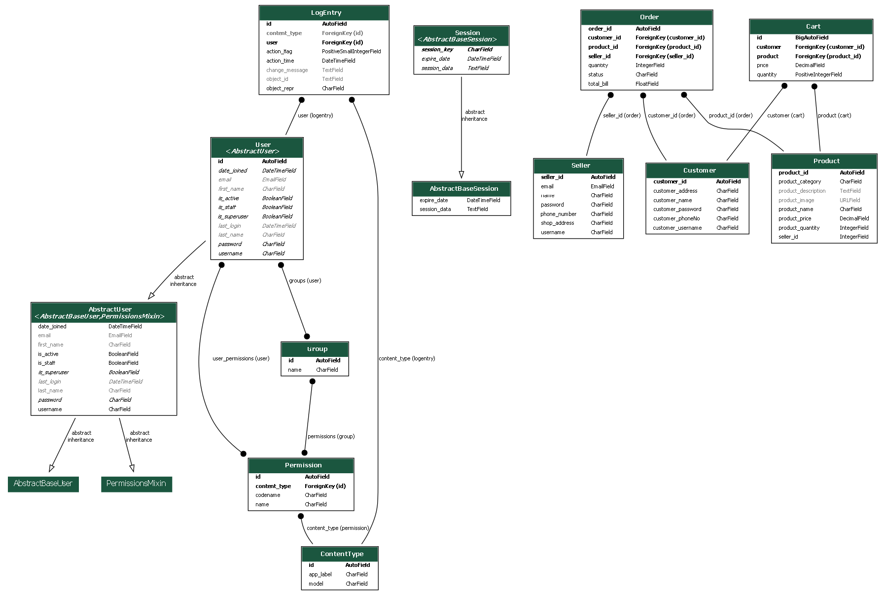

# E-Commerce Application



## Description

The E-Commerce Application is a Django and React-based web application designed for managing an online store. This application enables customers to browse products, add items to their carts, and place orders, while providing features for sellers to manage product listings and inventory. Admins have full control over the data, including the ability to manage users, products, and orders.

## Technologies Used

This project utilizes the following technologies:

- **Django**: A high-level Python web framework for developing the application backend, managing user authentication, and handling database operations.
- **React**: A popular JavaScript library for building user interfaces, used for the frontend of the application.
- **SQLite**: A lightweight relational database used for storing and managing data, integrated with Django’s ORM (Object-Relational Mapping).
- **Git & GitHub**: Version control and collaboration tools for managing the project's source code and tracking changes.

## Database Overview

The `ecommerce_db` database includes several tables, managed by Django models:

- **Customers**: Manages customer data and includes information like name, contact details, and order history.
- **Products**: Stores product details, including product name, price, availability, and categories.
- **Orders**: Manages customer orders, including details of items ordered and payment status.
- **Sellers**: Contains information about sellers and their products.

## Table Structure (Django Models)

### 1. Customer Model

- **customer_id**: Unique identifier for each customer (Primary Key).
- **customer_name**: Name of the customer.
- **customer_address**: Address of the customer.
- **customer_phoneNo**: Phone number of the customer.
- **customer_username**: Unique username for the customer login.
- **customer_password**: Password for the customer account (stored securely).

### 2. Product Model

- **product_id**: Unique identifier for each product (Primary Key).
- **item_name**: Name of the product.
- **price**: Price of the product.
- **on_discount**: Boolean indicating if the product is on discount.
- **discount_price**: Discounted price, if applicable.
- **category**: Category to which the product belongs.
- **stock**: Quantity of product available.
- **description**: Detailed description of the product.

### 3. Order Model

- **order_id**: Unique identifier for each order (Primary Key).
- **customer**: Foreign key to the Customer model.
- **total_price**: Total price for the order.
- **order_date**: Date when the order was placed.
- **status**: Status of the order (e.g., `pending`, `shipped`, `delivered`).

### 4. Seller Model

- **seller_id**: Unique identifier for each seller (Primary Key).
- **seller_name**: Name of the seller.
- **seller_address**: Address of the seller.
- **products**: Foreign key to the Product model, linking sellers with their products.

## Getting Started

### 1. Clone the Repository

   ```bash
   git clone https://github.com/yamini-31/E-Commerce.git
   cd E-Commerce
   ```

### 2. Backend Setup

1. **Set up a virtual environment**:

   ```bash
   python -m venv venv
   source venv/bin/activate  # For Linux/Mac
   venv\Scripts\activate     # For Windows
   ```

2. **Install dependencies**:

   ```bash
   pip install -r requirements.txt
   ```

3. **Run migrations**:

   ```bash
   python manage.py migrate
   ```

4. **Create a superuser** (for accessing the Django admin):

   ```bash
   python manage.py createsuperuser
   ```

5. **Run the backend server**:

   ```bash
   python manage.py runserver
   ```

   The backend will be running at `http://127.0.0.1:8000`.

### 3. Frontend Setup

1. **Navigate to the frontend directory**:

   ```bash
   cd frontend
   ```

2. **Install frontend dependencies**:

   ```bash
   npm install
   ```

3. **Start the frontend development server**:

   ```bash
   npm start
   ```

   The frontend will be running at `http://localhost:3000`.

### 4. Environment Variables

Create a `.env` file in the root of the project to store environment variables. Example:

## Usage

Access the application in your web browser at `http://127.0.0.1:8000/`. 

- **Customers** can browse products, add them to their cart, place orders, and view order history.
- **Sellers** can manage product listings, monitor stock, and update product information.
- **Admins** can manage all data via Django's admin panel at `http://127.0.0.1:8000/admin`.

## API Documentation

The backend API is documented using Django REST Framework's browsable API. You can access it by navigating to `http://127.0.0.1:8000/api/` when the backend server is running.

## License

This project is licensed under the MIT License - see the [LICENSE](LICENSE) file for details.

---

This README provides a structured and comprehensive overview for your E-Commerce Application. Adjust any specific instructions or environment configurations as needed!
